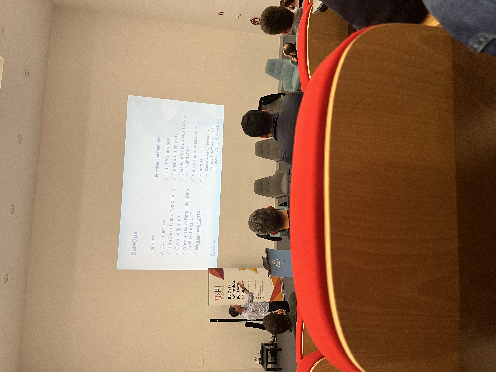
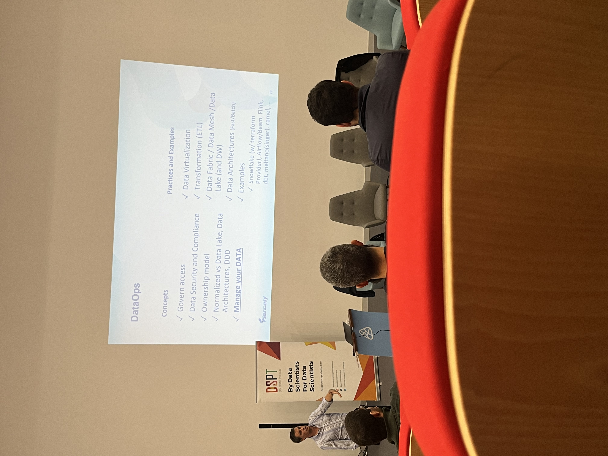
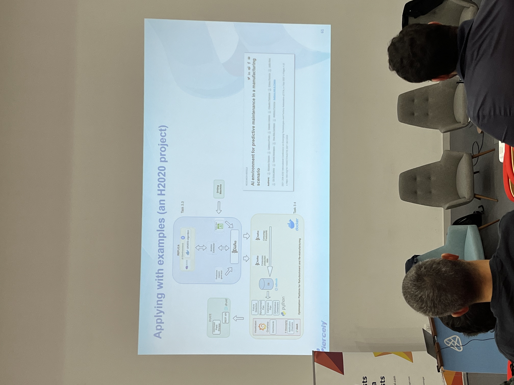

The MeetUp took place on PCI on Ílhavo and was organized by the DSPT; as my master thesis is about MLOps, this meetup was exciting because it approached my research's main topic.
I liked it because it was my first time attending a DSPT event. I also met new people from the area.

The meetup has 2 sections; the first one with a presentation hosted by António Howcroft Ferreira, where subjects like MLOps, AIOps, and DataOps were approached and were given some good practices advice and what to not do in some scenarios. 

Then, the speaker shows an implementation of an MLOps system in a device to be used in an industrial environment; the main objective was to understand the failures that can happen on an industrial floor. Then, in the final section, a coffee break let me meet some new people in the Data Science field who have experience in the Machine Learning subject.

