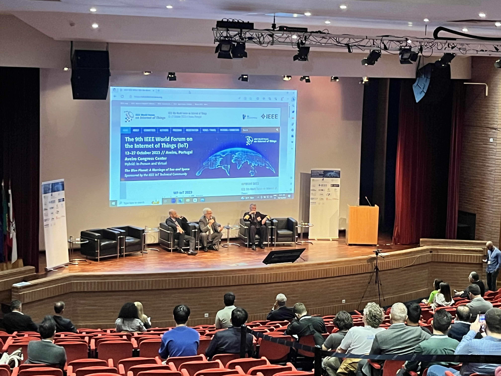
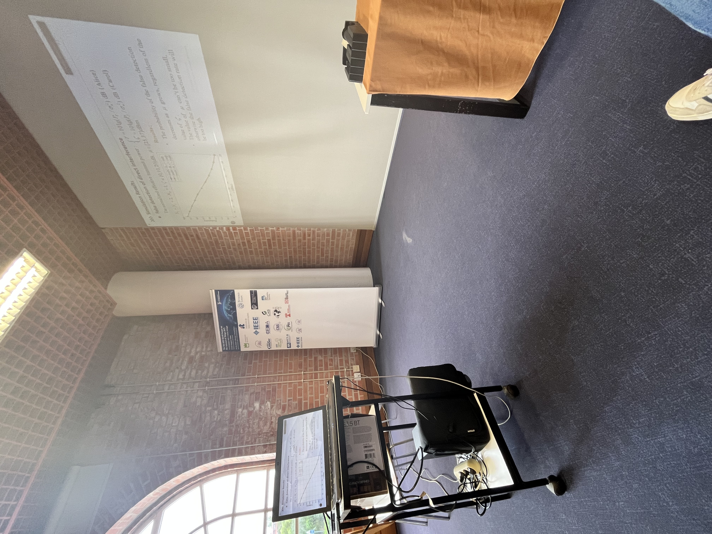
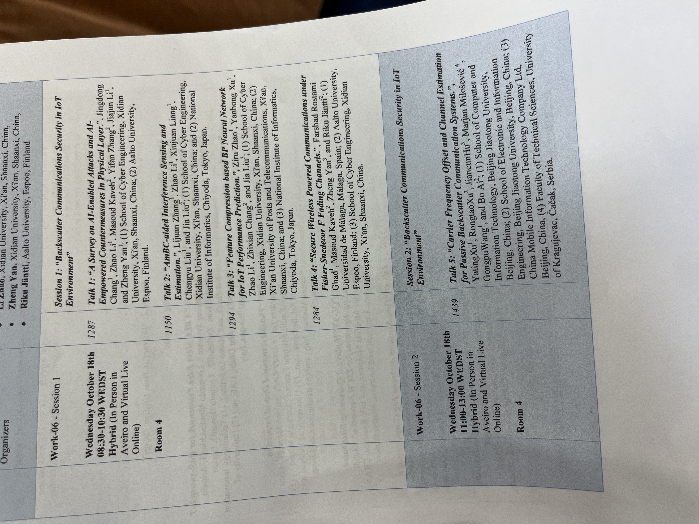
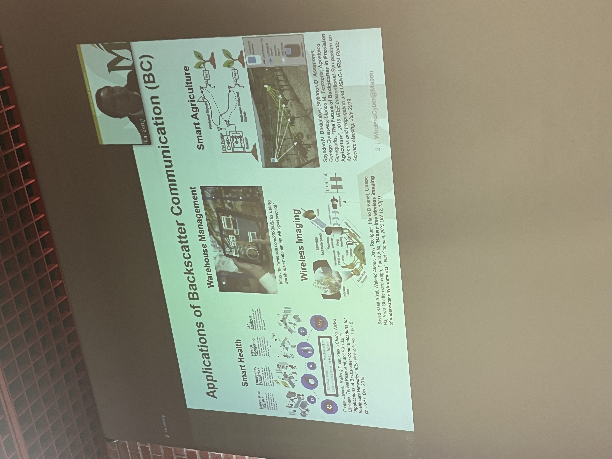
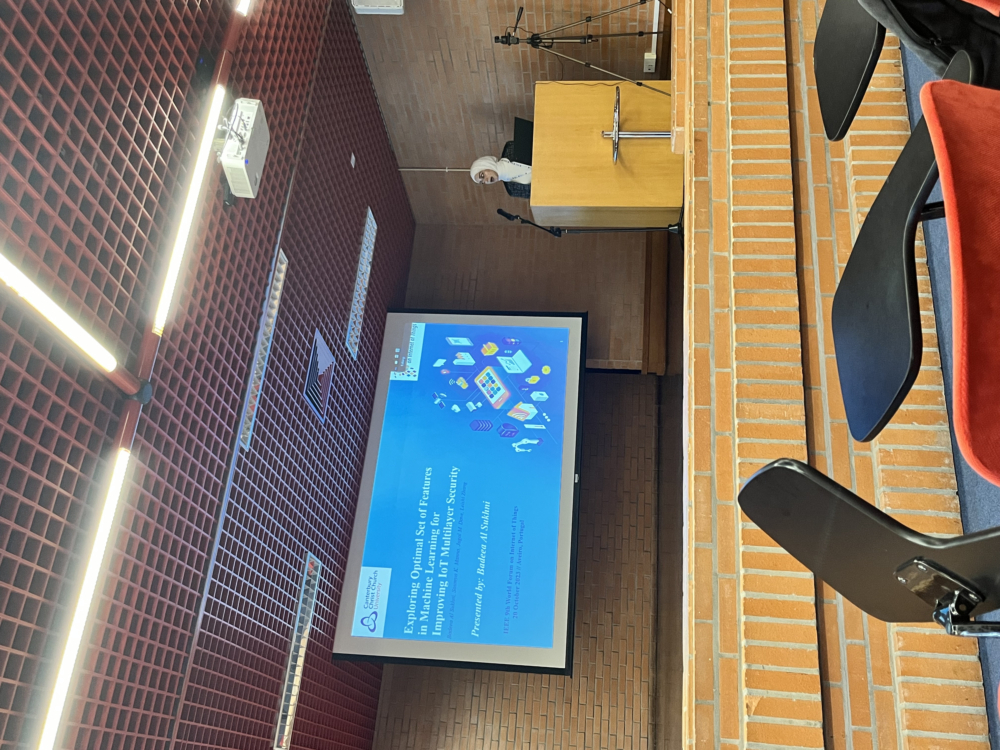

The IEEE WFIoT Conference took place in Aveiro in October 2023. I was a volunteer at the conference, and I had the opportunity to meet people from all over the world and learn about the latest technologies in the IoT area. Besides IoT is not the central area of my research, there were a lot of sessions where Machine Learning came up as a solution to solve some problems in IoT, so I found it very interesting to attend those sessions and to learn more about the application of Machine Learning in the IoT field.

The conference occurred in Centro de Congressos de Aveiro between the 16th and 20th of October. I really liked participating as a volunteer because it was my first time at a conference, and then, in this dimension, it was a pleasure to be part of the organization team.

As a volunteer, I had to be aware of the setup for the session, like calibrating the camera, managing the Zoom session for those assisting virtually, and helping the speakers with any doubts.
With this, I could attend many sessions and learn more about IoT. I have attended sessions about cybersecurity in IoT, how IoT uses machine learning techniques to extract intelligence from all the data collected in devices, the relationship between IoT and digital twins, and the IoT for road safety. It was an excellent experience because it was my first time at a world conference. I learned more about IoT, and last but not least, I met new people in the session, which made the experience even more remarkable. I contacted people from all parts of the world, which was very pleasant.

The conference was not about my main research area, but as I said before, topics like Machine Learning and Artificial Intelligence were addressed in the context of IoT, so I learned more about them. I will highlight, for example, research where the objective was to optimize the energy consumption of houses. The houses were monitored by IoT devices, and the data was collected to make predictions using Machine Learning models to optimize energy consumption, mainly in house heating.

Another example that caught my attention was a research work where the researchers integrated Machine Learning techniques and Virtual Reality in wind farms. They could extract data from the IoT devices, make predictions, and navigate the wind farm using virtual reality glasses to check the turbines and see their metrics.

